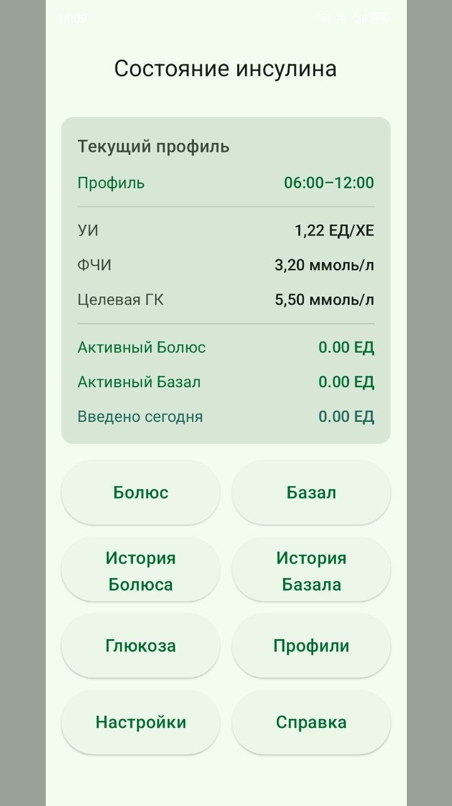
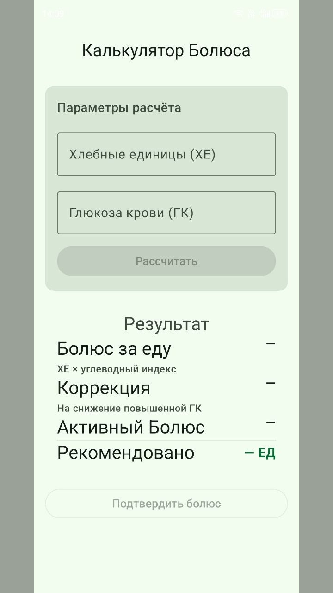
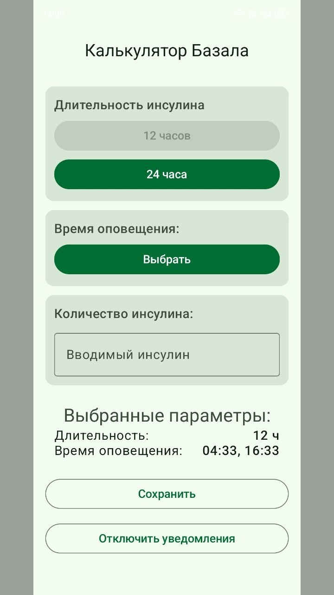
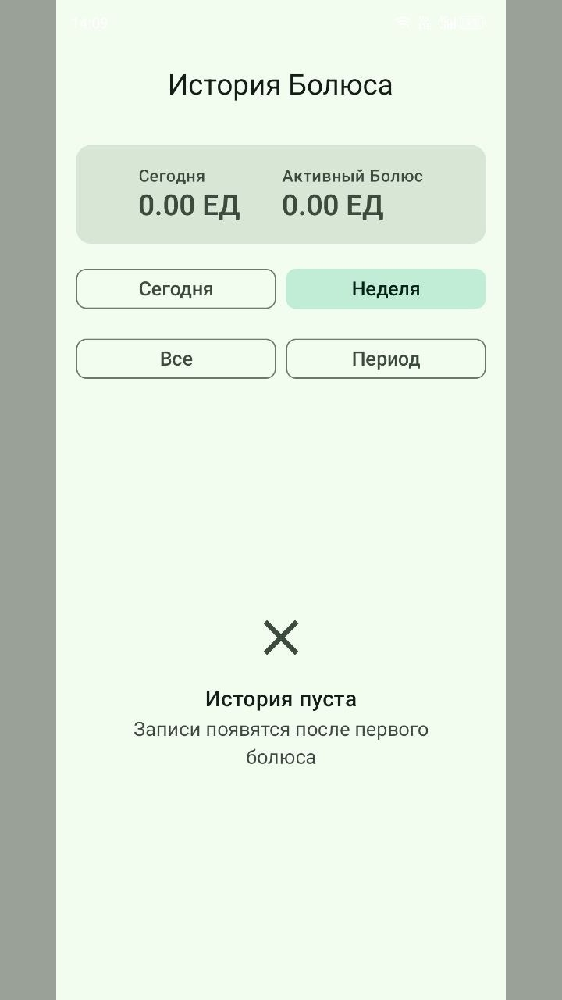
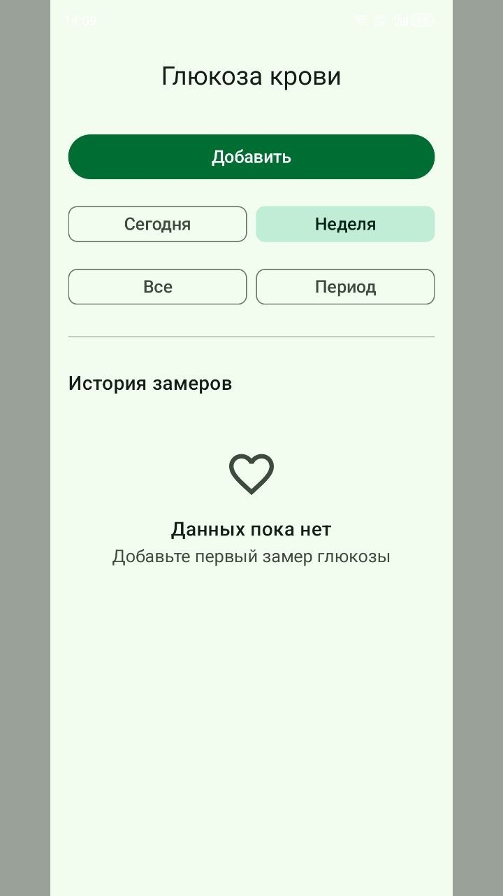

# 📱 "Insulin Calculator" — A Mobile Application for Insulin Dose Tracking and Calculation

Welcome! This is my pet project — an Android application for people who need a simple mobile tool to calculate recommended insulin doses, track bolus and basal injections and record blood glucose readings in one place.

The application is designed as a personal assistant for day-to-day diabetes self-management. It helps users calculate a suggested bolus dose based on bread units (XE), current blood glucose, and an individual profile with insulin-to-carb ratio, insulin sensitivity factor, target glucose, and insulin activity duration.

> ⚠️ **Medical disclaimer:** this application is not a medical device and does not replace professional medical advice. All calculations are recommendations only, and the user remains responsible for treatment decisions.

## 🧠 Main Idea

The project combines:
- Bolus insulin calculation based on food intake and blood glucose
- Basal insulin tracking with configurable duration
- Blood glucose history and visual trends
- Multiple personal profiles with individual calculation parameters
- Local storage of insulin and glucose history
- Reminder notifications for insulin timing

## 🛠 Technologies

#### Android
* Kotlin / Jetpack Compose (Compose, ViewModel, Navigation)
* Material 3
* Hilt
* Room
* SharedPreferences / DataStore-style settings repository
* Android notifications and alarm scheduling

#### Local Data
* Room database
* Local entities for bolus records, basal records, glucose readings, and user profiles

## 📲 Screenshots (Demo)







## 🔧 Main Features

* 💉 Calculate recommended bolus insulin doses
* 🍞 Use bread units (XE), insulin-to-carb ratio (ICR), insulin sensitivity factor (ISF), and target blood glucose in calculations
* 🧮 Separate meal bolus and correction bolus values
* ⏱ Track active bolus and basal insulin
* 📊 Add, view, and delete blood glucose readings
* 📈 Display glucose history with a chart
* 🗂 Maintain multiple calculation profiles
* 🕒 Filter bolus and basal history by today, week, all time, or custom period
* 🔔 Schedule insulin reminder notifications
* 🌐 Switch between Russian, English, and Kazakh languages

## Current Limitations

- The application provides recommendations only and should not be used as the only basis for medical decisions
- There is no cloud synchronization; all data is stored locally on the device
- There is no account system or backup/restore flow for user data
- The calculator uses manually entered values and does not integrate with glucose meters, CGMs, or insulin pumps
- The current project focuses on personal use and is not intended for regulated clinical deployment

<!--
## 📁 Project structure
```
📦 app/
 ┣ 📂 src/main/java/com/kugukov/insulincalculator/
 ┃ ┣ 📂 data/
 ┃ ┃ ┣ 📂 localDB/
 ┃ ┃ ┣ 📂 repository/
 ┃ ┃ ┗ 📂 settings/
 ┃ ┣ 📂 domain/
 ┃ ┣ 📂 notification/
 ┃ ┣ 📂 ui/
 ┃ ┃ ┣ 📂 bolusScreen/
 ┃ ┃ ┣ 📂 basalScreen/
 ┃ ┃ ┣ 📂 glucoseScreen/
 ┃ ┃ ┣ 📂 profilesListScreen/
 ┃ ┃ ┣ 📂 settingsScreen/
 ┃ ┃ ┗ 📂 helpScreen/
 ┃ ┗ 📜 MainActivity.kt
```

---
-->

## 🧪 Example of Bolus Calculation Usage

1. The user creates or selects a personal profile
2. The profile stores ICR, ISF, target blood glucose, and insulin duration
3. The user enters bread units (XE) and current blood glucose
4. The application calculates:
   * Meal bolus
   * Correction bolus
   * Total recommended bolus
5. The user reviews the warning message and confirms the injection record
6. The bolus is saved locally and appears in the history

## 🔐 Privacy and Safety

* All application data is stored locally on the device
* Profiles, glucose readings, bolus records, and basal records are not publicly available
* The application shows warning messages before saving insulin-related actions
* Notification permissions are requested before reminders are used
* The project includes educational content, but it does not replace a healthcare professional

## 🧩 Possible Improvements

* Add backup and restore functionality
* Implement optional cloud synchronization between devices
* Add integration with glucose meters, CGMs, or insulin pump data sources
* Add onboarding with safety instructions and calculator setup guidance
* Expand educational articles and add more localized medical content
* Add automated UI tests and more unit tests for dose calculation logic
